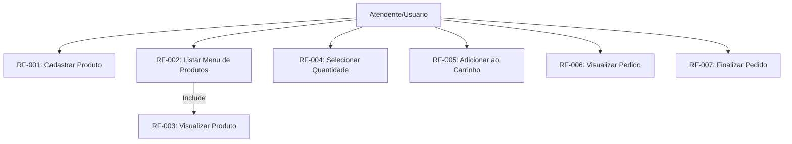
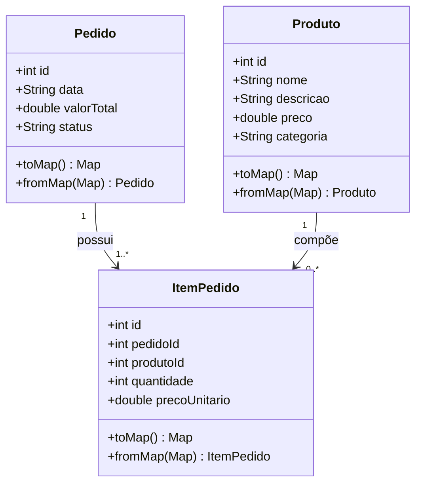
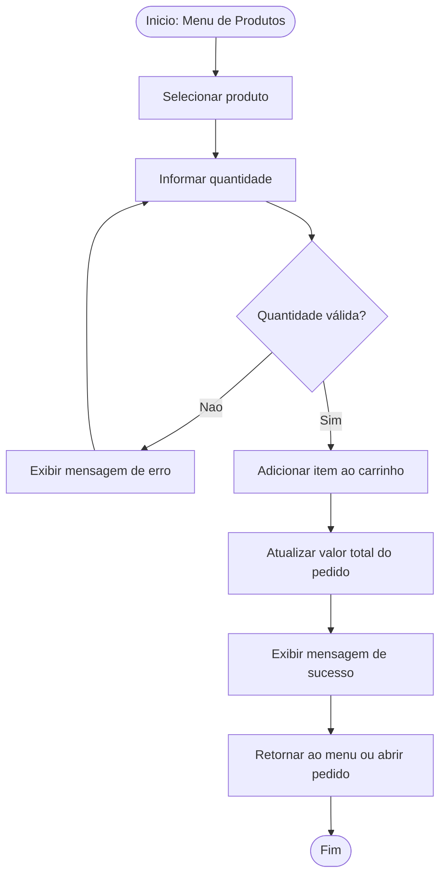

# Documentação de Requisitos de Software (DRS / SDR) - Aplicativo de Recebimento de Pedidos

**Padro de Referência:** ISO/IEC/IEEE 29148:2018

**Versão:** 1.0

---

## 1. Introdução

### 1.1 Finalidade

Este documento especifica os requisitos do aplicativo movel de Recebimento de Pedidos. O sistema utiliza Flutter para a interface e SQLite para a persistencia local dos dados.

### 1.2 Escopo do Sistema

O aplicativo destina-se ao cadastro de produtos em um menu simples e ao recebimento de pedidos. Ele permite visualizar produtos disponiveis, adicionar itens ao carrinho e finalizar um pedido.

* **O que está no escopo:** Cadastro de produtos, listagem do menu, adição de produtos ao carrinho, controle de quantidade, pedido em andamento e persistência local em SQLite.
* **O que está fora de escopo:** Login de usuarios, pagamento online, entrega, cupom de desconto, sincronização em nuvem e integração com sistemas externos.

---

## 2. Descrição Geral

### 2.1 Perspectiva do Produto

O produto funciona de forma autônoma em dispositivos móveis, sem depender de internet para suas funções principais. A organização do projeto segue camadas simples, como model, controller e view.

### 2.2 Funções do Produto

* Manter o cadastro de produtos do menu.
* Listar produtos disponíveis para pedido.
* Selecionar quantidade de um produto.
* Adicionar produtos ao carrinho.
* Exibir o pedido em andamento.
* Finalizar o pedido.

### 2.3 Classes e Características dos Usuários

* **Atendente/Usuário:** Pessoa responsável por visualizar o menu, selecionar produtos e montar um pedido simples.

---

## 3. Requisitos do Sistema

### 3.1 Requisitos Funcionais (RF)

| Identificador | Requisito | Descrição | Prioridade |
| --- | --- | --- | --- |
| **RF-001** | Cadastrar Produto | O sistema deve permitir o cadastro de um produto contendo: nome, descrição, preço e categoria. | Essencial |
| **RF-002** | Listar Menu de Produtos | O sistema deve exibir o menu com os produtos disponíveis para pedido. | Essencial |
| **RF-003** | Visualizar Produto | O sistema deve exibir as informações principais do produto, como nome, descrição, preço e categoria. | Essencial |
| **RF-004** | Selecionar Quantidade | O sistema deve permitir selecionar a quantidade do produto antes de adicionar ao carrinho. | Essencial |
| **RF-005** | Adicionar ao Carrinho | O sistema deve permitir adicionar um produto ao carrinho do pedido em andamento. | Essencial |
| **RF-006** | Visualizar Pedido | O sistema deve exibir os produtos adicionados, suas quantidades e o valor total do pedido. | Essencial |
| **RF-007** | Finalizar Pedido | O sistema deve permitir finalizar o pedido com os itens adicionados ao carrinho. | Essencial |
| **RF-008** | Persistência Local | O sistema deve salvar os registros no banco de dados SQLite do aparelho. | Essencial |

### 3.2 Requisitos Não-Funcionais (RNF)

| Identificador | Requisito | Descrição | Categoria |
| --- | --- | --- | --- |
| **RNF-001** | Portabilidade | O aplicativo deve rodar em dispositivos Android compatíveis com Flutter. | Portabilidade |
| **RNF-002** | Desempenho | O menu, o carrinho e o pedido devem carregar em até 2 segundos. | Eficiência |
| **RNF-003** | Disponibilidade | O aplicativo deve funcionar offline. | Confiabilidade |
| **RNF-004** | Arquitetura | O código-fonte deve manter separação simples entre models, controllers e views. | Manutenibilidade |

---

## 4. Diagramas de Engenharia de Software

### 4.1 Diagrama de Casos de Uso

Mostra o comportamento do sistema na perspectiva do usuário.

### 4.2 Diagrama de Classes

Demonstra as principais entidades do sistema e o relacionamento entre elas.

### 4.3 Diagrama de Fluxo (Adicionar Produto ao Carrinho)

Ilustra o fluxo para adicionar um produto ao pedido em andamento.

---

## 5. Análise de Risco

| Risco | Impacto | Mitigação |
| --- | --- | --- |
| Produto cadastrado com preço incorreto | Alto | Validar o preço antes de salvar o produto. |
| Quantidade inválida no carrinho | Medio | Permitir apenas quantidades maiores que zero. |
| Perda de dados do pedido | Alto | Salvar os dados do pedido e dos itens no SQLite. |

---

## 6. Controle de Vers~pes

| Versão | Data | Descrição |
| --- | --- | --- |
| 1.0 | 11/06/2026 | Criação da documentação inicial do sistema. |